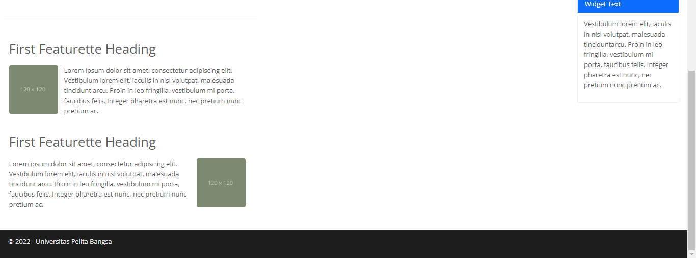

# Lab6Web
## Membuat Layout Web sederhana Menggunakan CSS Framework (Twitter Bootstrap)

Pertama download terlebih dahulu Bootstrapnya melalui link berikut `<http://getbootstrap.com>` jika sudah
kemudian ekstrak file nya. Kemudian kita buat file HTML dengan nama `<index.html>` lalu masukkan kodingan seperti gambar di bawah ini,
disini saya menggunakan bootstrap pada saat membuka navbar.

dan membuat isi dari body menggunakan Bootstrap `<jimbotron>`

Kemudian deklarasikan CSS nya seperti berikut ini 

Maka tampilan Website nya seperti ini 

Selanjutnya kita isi Website dengan Artikel. Contoh codingannya seperti ini :

Dan Deklarasikan CSS nya seperti berikut ini :

Maka tampilan Website nya akan seperti ini :

Selanjutnya, membuat Widget Sidebar, disini saya menggunakan Bootstrap `<list-group>` codingannya seperti ini :

Deklarasikan dengan CSS agar lebih menarik 

Tampilan di Website akan seperti ini :

### Tampilan Keseluruhan Website

Terima Kasih...